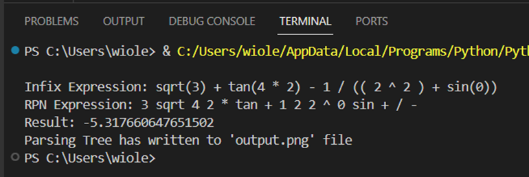
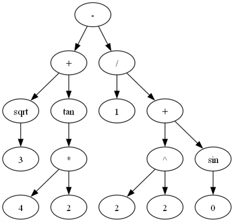

# 🧮 SimpleExpressionsParser 🧮

The repository contains a project implemented as part of the Automata, Languages and Computation course at the university.

## 🛠️ Functionalities 

The project involves transforming a sequence of characters representing a mathematical expression in reverse Polish notation, calculating the value of the given expression and its graphical representation in the form of a syntax tree. Therefore, the project applies several computer science and mathematical concepts, which will be discussed below.

- _Lexer_ – the first stage of processing that decomposes the input string into a series of tokens. Each token represents an atomic element of an expression, such as a number, operator, or mathematical function. Lexer operations are based on the principles of finite automata, where each state represents the recognition of a specific type of token.

- _Parser_ – transforms a linear sequence of tokens into a syntax tree, representing the hierarchical structure of an expression according to the rules of context-sensitive grammar. Using an algorithm for processing expressions in reverse Polish notation (RPN), the parser effectively separates operands and operators, enabling the proper determination of the order in which mathematical operations are performed.

- _Syntax tree_ – a graphical structure that allows for a visual representation of the structure of an expression. The nodes of the tree represent operators and the leaves are operands. This structure is essential for the efficient processing and evaluation of mathematical expressions because it reflects the relationships between the different parts of the expression.

- _Evaluator_ – the last stage is the evaluation of the syntax tree or RPN sequence, where each operation is performed according to its priority. This process uses the stack structure to temporarily store and manipulate operands and the results of intermediate operations.

**Mathematical functions used**

The parser is equipped with recognition of basic mathematical operations (addition, subtraction, multiplication, division, exponentiation) and special functions (sin, cos, tan, cotan, exp, sqrt), which enables the handling of a wide range of mathematical expressions.

## ▶️ Sample call 

Below is the parsing tree and RPN representation along with the calculation result for the following data set:
`expression = "sqrt(3) + tan(4 * 2) - 1 / (( 2 ^ 2 ) + sin(0))"`

**Terminal:**

**Parsing tree:**

To be able to generate a parsing tree, it was necessary to install the `graphviz` library and import the `Digram` module from it. This library is used to create data structures and visualize them in the form of graphs. The `Digraph` module itself is used to create directed graphs.

## 🧾 Summary 

A program for parsing simple mathematical expressions provides a practical application of complex computer science and mathematical concepts. It also presents the integration of lexical, syntactic and evaluative analysis into one coherent system. The lexer, parser and evaluator transform a textual mathematical expression into a data structure, returning the result of operations on the entered data. Thanks to this you can draw conclusions about the structure of the expression. This process not only facilitates automatic mathematical calculations, but also offers a visualization of the structure of the expression, which is a key element of knowledge when learning reverse Polish notation.